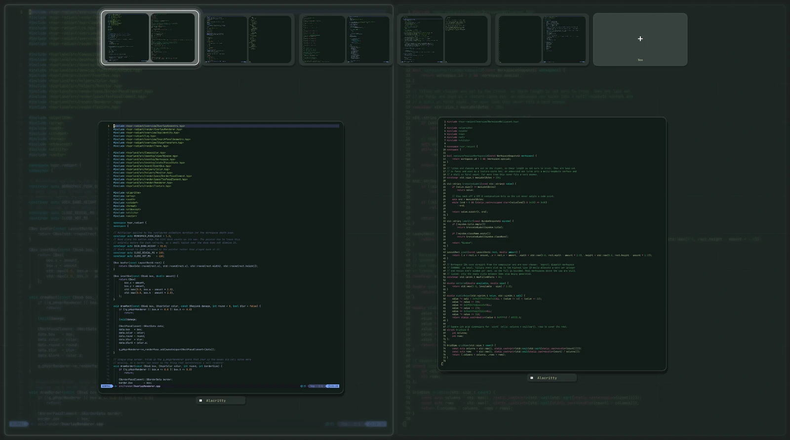
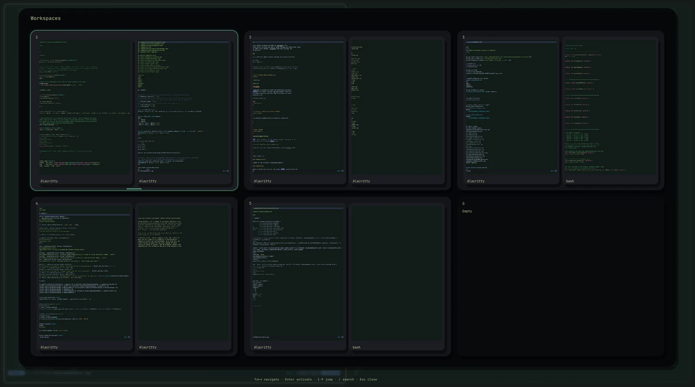
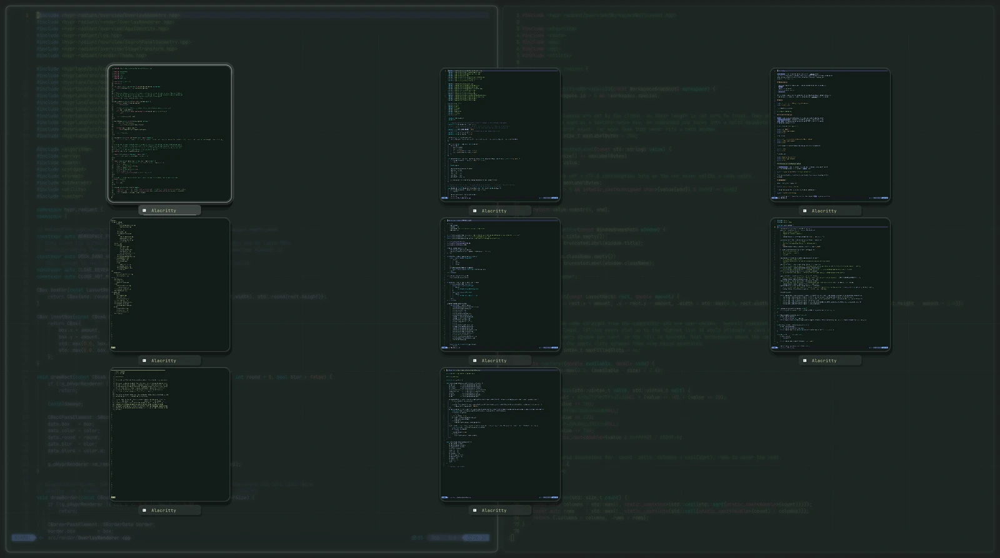

# hypr-radiant

A window overview for Hyprland. One keybind shows every window on every
workspace, so you jump straight to the one you want instead of cycling through
workspaces looking for it.

It reads your Omarchy theme, so it should match the rest of your desktop without
configuring anything.

The windows of the current workspace spread out across the screen, and a
workspace shelf slides in at the top edge when the pointer reaches it, so you can
move between workspaces without leaving the overview.



## Requirements

- Hyprland 0.55.x or 0.56.x, with development headers matching the compositor you run
- `hyprpm`
- CMake 3.25 or newer
- A C++23 compiler
- `pkg-config`

The plugin ABI is tied to the exact Hyprland build. If the headers do not match,
the plugin refuses to load, sends a notification, and Hyprland unloads it again.
Nothing breaks, but you do need to rebuild after a Hyprland update.

## Install

`hyprpm` needs superuser rights the first time, since it creates
`/var/cache/hyprpm/` and installs matching Hyprland headers. Make sure `sudo` or
`doas` is available before you start.

```sh
hyprpm update
hyprpm add https://github.com/nsumbadze/hypr-radiant
hyprpm enable hypr-radiant
hyprpm reload
```

`hyprpm enable` saves the plugin's enabled state. To load enabled plugins
automatically whenever Hyprland starts, add this once to `hyprland.lua`:

```lua
hl.on("hyprland.start", function()
    hl.exec_cmd("hyprpm reload -n")
end)
```

Omarchy currently uses Hyprland's legacy configuration syntax. Put the
equivalent line in `~/.config/hypr/autostart.conf`:

```ini
exec-once = hyprpm reload -n
```

The plugin registers its default shortcut whenever it loads, so no separate
keybind is needed after a restart.

After rebuilding or updating it:

```sh
hyprpm update
hyprpm reload
```

To remove it:

```sh
hyprpm disable hypr-radiant
hyprpm remove hypr-radiant
hyprpm reload
```

## Usage

Press `SUPER+A` to open or close the overview. A three-finger swipe up opens it
and a swipe down closes it.

The plugin leaves an existing `SUPER+A` binding untouched. To use a different
shortcut, disable the built-in one and bind the toggle yourself:

```ini
plugin {
    radiant {
        shortcut_enabled = false
    }
}

bind = SUPER, TAB, exec, hyprctl dispatch radiant:toggle
```

| Dispatcher | What it does |
| --- | --- |
| `radiant:toggle` | Open or close the overview |
| `radiant:open` | Open it, only if it is closed |
| `radiant:close` | Close it, only if it is open |
| `radiant:preferences` | Open the overview preferences |
| `radiant:app` | App Exposé for the focused application |
| `radiant:shelf show\|hide\|toggle` | Control the workspace shelf |
| `radiant:status` | Notification with the current state, for debugging |

While it is open, swipe left or right to preview the next workspace. Set
`gesture_enabled = false` if something else already owns that gesture.

## Preferences

Press `Ctrl+,` while the overview is open. The native Omarchy-style panel controls:

- Stage or Workspace Wall
- Spatial or application-grouped window arrangement
- Theme accent or an explicit green, blue or violet accent
- App Exposé for the focused application

Changes are saved immediately to
`~/.config/hypr-radiant/preferences.conf` (or `$XDG_CONFIG_HOME` when set) and
survive plugin and Hyprland restarts. `THEME` follows the active Omarchy
`colors.toml`; it is re-read whenever the overview opens.

## Views

Stage is the default. It spreads the current workspace across the screen and
keeps a workspace shelf at the top edge.

Workspace Wall shows all workspaces at once as a grid of cards:



App Exposé collects every window belonging to the focused application:



## Controls

With the mouse:

- Hover a workspace or window to move the selection
- Click a workspace to switch to it, click a window to focus it
- Drag a window onto a workspace card to move it there: the card lifts out of the
  wall and follows the pointer, the workspace under it lights up as the
  destination, and the drop settles the card into place. Releasing over the
  window's own workspace, or over nothing, sends it back where it came from
- Drag a window onto the trailing `+`, or just click it, to create a workspace
- Pointer at the top edge reveals the shelf, at the bottom edge the dock
- Scrolling shows and hides the shelf, `Ctrl` + wheel steps through workspaces
- Hover a window and click the button in its corner to close it

With the keyboard:

- `Left` / `Right` move along the workspace shelf
- `Down` drops into the windows of the selected workspace, `Up` goes back
- `1`–`9` jump straight to a workspace
- Start typing to search windows by title or class
- `/` opens search with every window listed
- `Tab` switches between the spatial and application-grouped views
- `Ctrl+,` opens or closes preferences
- `Enter` activates the selection
- `Esc` closes search first, the overview second

## Configuration

All of it is optional. These are the defaults:

```ini
plugin {
    radiant {
        opacity = 0.94
        animation_duration = 180
        layout = stage
        accent_color = auto
        background_color = auto
        foreground_color = auto
        font_family = JetBrainsMono Nerd Font
        shortcut_enabled = true
        gesture_enabled = true
        gesture_fingers = 3
        gesture_distance = 300
    }
}
```

| Option | Notes |
| --- | --- |
| `opacity` | Overlay opacity, `0.0` to `1.0` |
| `animation_duration` | Fade duration in ms, `0` to `2000` |
| `layout` | `stage` or `workspace_wall` |
| `accent_color` | `auto` follows the Omarchy theme; or `#RRGGBB`, `#RRGGBBAA`, `rgb()`, `rgba()` |
| `background_color`, `foreground_color` | `auto` follows the Omarchy theme, or set them yourself |
| `font_family` | Interface font |
| `shortcut_enabled` | Register `SUPER+A` when it is not already bound |
| `gesture_enabled` | Trackpad swipe capture |
| `gesture_fingers` | `3` or `4` |
| `gesture_distance` | Swipe travel in pixels, `120` to `800` |

If no Omarchy theme can be read, the colours fall back to a neutral grey. The
palette is re-read every time the overview opens, so switching themes does not
need a reload.

The settings panel starts by following these Hyprland values. Choosing Stage or
Wall saves that view as the preference; `THEME` returns the accent to its
Hyprland/Omarchy-backed value.

## Building it yourself

Build and reload the development plugin in one command:

```sh
cmake -S . -B build -DCMAKE_BUILD_TYPE=Release \
    && cmake --build build --target hypr-radiant -j"$(nproc)" \
    && (hyprctl plugin unload "$PWD/build/hypr-radiant.so" 2>/dev/null || true) \
    && hyprctl plugin load "$PWD/build/hypr-radiant.so"
```

That gives you `build/hypr-radiant.so` and loads it directly instead of going
through `hyprpm`, which is much faster while working on it. To unload it:

```sh
hyprctl plugin unload "$PWD/build/hypr-radiant.so"
```

Unloading is clean, so you can reload as often as you want. Direct loading is
temporary and does not survive a Hyprland restart; use the `hyprpm` installation
and startup line above for persistent loading. While developing an uncommitted
build, you can instead put its absolute path in `~/.config/hypr/autostart.conf`:

```ini
exec-once = hyprctl plugin load /absolute/path/to/hypr-radiant/build/hypr-radiant.so
```

## Troubleshooting

First check the compositor, loaded plugin, and current configuration:

```sh
hyprctl version
hyprctl plugin list
hyprctl configerrors
hyprctl devices
hyprctl getoption plugin:radiant:gesture_enabled
hyprctl getoption plugin:radiant:gesture_fingers
hyprctl getoption plugin:radiant:gesture_distance
hyprctl dispatch radiant:status
```

The expected gesture values are `int: 1`, `int: 3`, and `float: 300`. A
`set: false` line means the plugin is using its default value; it does not mean
the option is disabled.

If the dispatcher opens the overview but a swipe does not, follow Hyprland's
input log and then make one deliberate three-finger swipe up:

```sh
hyprctl rollinglog --follow
```

Look for a libinput `gesture: [3fg]` line. If the log only reports `[2fg]`, the
touchpad or libinput did not recognize three fingers, so the gesture never
reached the plugin. To collect a smaller report after reproducing the problem:

```sh
hyprctl rollinglog | rg -i 'hypr-radiant|gesture|swipe'
```

If the log shows the third contact entering `BUTTON_STATE_BOTTOM`, libinput is
treating the bottom of the pad as a software button instead of part of the
gesture. Enable clickfinger behavior in Hyprland:

```ini
input {
    touchpad {
        clickfinger_behavior = true
    }
}
```

You can also test four fingers or a shorter swipe distance without editing any
files:

```sh
hyprctl keyword plugin:radiant:gesture_fingers 4
hyprctl keyword plugin:radiant:gesture_distance 120
```

Run `hyprctl reload` afterward to restore the values from your configuration.

## Tests

The layout, geometry, search, gesture and theme logic is kept separate from
Hyprland, so most of it runs without a compositor:

```sh
cmake -S . -B build/test -DCMAKE_BUILD_TYPE=Debug -DBUILD_TESTING=ON -DHYPR_RADIANT_BUILD_PLUGIN=OFF
cmake --build build/test
ctest --test-dir build/test --output-on-failure
```

There is also a harness that starts a nested headless Hyprland, loads the
plugin and takes screenshots, without touching your real session:

```sh
bash tests/harness/nested-session.sh run-happy-path
```

## License

MIT, see [LICENSE](LICENSE).
